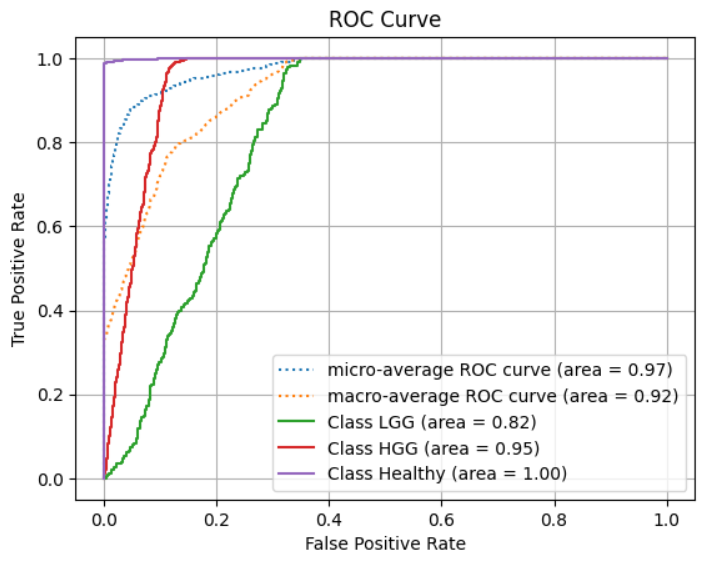
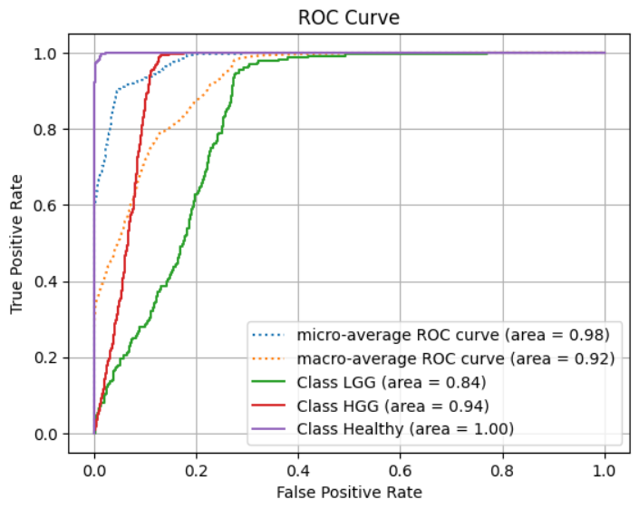

# About the Project:
This study focuses on the classification of brain tumors using advanced deep learning techniques applied to 3D MRI scans. Gliomas, highly invasive and life-threatening brain tumors, present significant challenges in accurate diagnosis and treatment planning. While traditional approaches rely on either 2D models that analyze individual MRI slices or 3D models that process entire volumetric data, this research explores a novel approach by leveraging spatiotemporal deep learning models adapted as spatiospatial models for tumor classification.
By interpreting the slice dimension in MRI scans as a pseudo-temporal axis, these models efficiently capture both in-plane spatial features and inter-slice correlations. To distinguish high-grade gliomas from healthy brain tissue and categorize them into low-grade kinds, two architectures are used: ResNet (2+1)D and ResNet Mixed Convolution. Metrics including classification accuracy, computational efficiency, and the models' capacity to extract intricate characteristics from volumetric data are used to assess them. The study also looks at the advantages of model pre-training for transfer learning. 
This approach demonstrates the potential of spatiospatial models in medical imaging, offering a promising direction for improving brain tumor classification and supporting clinical decision-making.

# Dataset:
1. https://www.kaggle.com/datasets/kbacon/ixi-t1
2. https://www.kaggle.com/datasets/vigneshirtt/miccaibrats2019

# Proposed Model:

  </img>

# Results:

  </img>
  </img>

